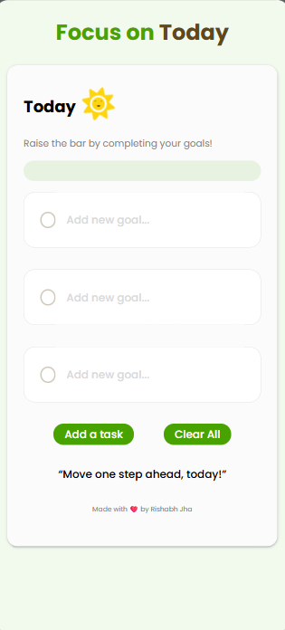

# Taskumi 📝

> **Focus on Today.**

Taskumi is a simple and focused daily task management application designed to help you concentrate on the goals that matter most today.

Instead of overwhelming you with an endless task list, Taskumi limits your daily goals to **5 tasks**, encouraging you to prioritize what really needs to get done.

## 🌐 Live Demo

**[Try Taskumi](https://taskumi.netlify.app/)**

## ✨ Features

- 🎯 **Daily Focus** — Focus on the goals that matter today.
- ✅ **Task Completion** — Mark tasks as completed as you make progress.
- 5️⃣ **5-Task Limit** — Add a maximum of 5 tasks per day.
- 🗑️ **Clear All** — Quickly remove all current tasks.
- 📱 **Responsive Design** — Works across desktop and mobile devices.
- ☀️ **Clean Interface** — Minimal design with fewer distractions.

## 🛠️ Tech Stack

- **HTML5** — Application structure
- **CSS3** — Styling and responsive design
- **JavaScript** — Task management and application logic
- **Netlify** — Deployment
- **Git & GitHub** — Version control

## 📸 Preview




## 🚀 Getting Started

### 1. Clone the repository

```bash
git clone https://github.com/your-username/taskumi.git
```

### 2. Navigate to the project

```bash
cd taskumi
```

### 3. Run locally

Open `index.html` in your browser.

For development, you can also use the **Live Server** extension in VS Code.

## 📂 Project Structure

```text
taskumi/
│
├── index.html
├── style.css
├── script.js
├── assets/
│   └── ...
└── README.md
```

## 🎯 Why Taskumi?

Taskumi is built around a simple idea:

> **You don't need a huge list of tasks. You need to know what matters today.**

By limiting the number of daily goals, Taskumi encourages prioritization and helps turn an overwhelming to-do list into a manageable daily plan.

## 🔮 Future Improvements

- [ ] Save tasks using Local Storage
- [ ] Edit existing tasks
- [ ] Add task priorities
- [ ] Add due dates
- [ ] Dark mode
- [ ] Task history
- [ ] Daily productivity statistics
- [ ] Custom task limits
- [ ] Improved animations and interactions

## 🤝 Contributing

Contributions, suggestions, and improvements are welcome.

1. Fork the repository.
2. Create a new branch.
3. Make your changes.
4. Commit your changes.
5. Push your branch.
6. Open a Pull Request.

## 📄 License

This project is licensed under the MIT License.

## 👨‍💻 Author

**Rishabh Jha**

Made with ❤️ and JavaScript.

---

### ⭐ Taskumi

**Move one step ahead, today!**